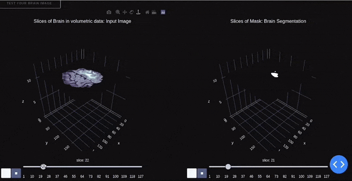
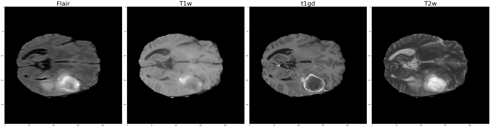
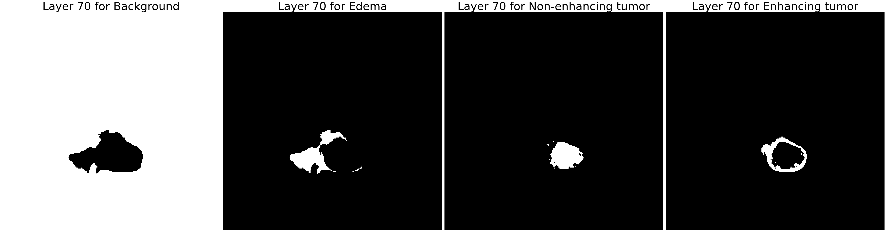
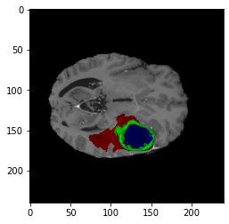
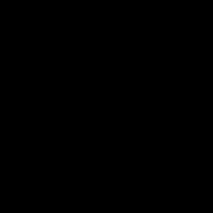
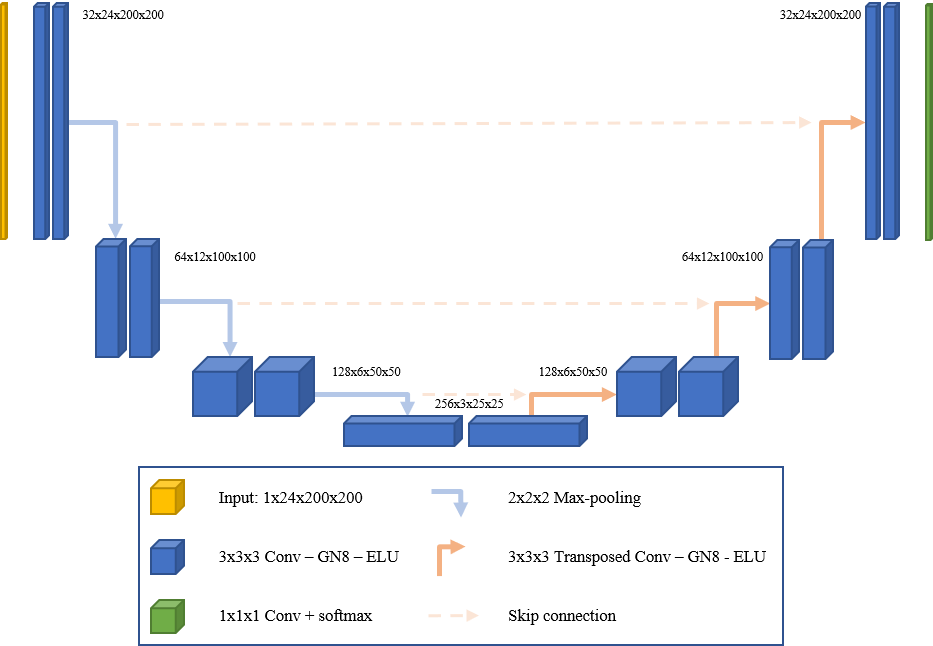
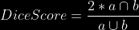
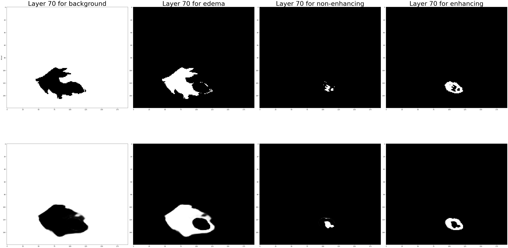

# 3D-Brain-Tumor-Segmentation

This project uses a 3d UNET  architecture to create segmentation masks for multimodal brain MRI images. It is then deployed to a Flask, Dash application
to visualise each and every slice of the brain MRI as well as its corresponding tumor. It not only segments the tumor but also detects its type whether it
is edema, enhancing or non-enhancing tumor. 

The task of brain tumor segmentation was done manually by radiologists which took hours to complete. This project helps reduce the 
time required to segment the brain tumor. Instead of hours with this model segmentation can be done in seconds.

## INDEX
* <a href="#Overview">Overview</a>
* <a href="#UnderstandingData">Understanding Data</a>
* <a href="#Setup">Setup</a>
* <a href="#Model">Model</a>
* <a href="#Training">Training</a>
* <a href="#Loss">Loss</a>
* <a href="#Results">Results</a>
* <a href="#FutureDevelopment">Future Development</a>
* <a href="#References">References</a>

<h2 id="Overview">Overview</h2>
Here is an overview of the website.
<p align = "center"></p>

<h2 id="UnderstandingData">Understanding Data</h2>

This data is quite different from the basic images. The dataset is a 4d image. 
The first three dimensions are the length, width and height. The fourth dimension however describes the type of scan.
There are four different types of scan: T1, T1Gd, T2, T2-FLAIR.
These four scans can be seen here.
<p align = "center"></p>

This is the 70th slice of MRI scans.

The labels are a bit different. They are three-dimensional. The sizes are similar to the 
inputs. However, it has four labels: background, edema, enhancing and non-enhancing tumor. 
The model not only segments the tumor but also identifies the type of tumor.

Here is how the 70th slide of the label for this particular brain looks.
<p align = "center"></p>

So, if we combine the two and separate the tumors based on their type we would get something like this
for the 70th slide.
<p align = "center"></p>

And now to get a look at all the slides, I have made this animation.
<p align = "center"></p>

<<h2 id="Setup">Setup</h2>

Clone the repository : <code>git clone https://github.com/Shreyz-max/3D-Brain-Tumor-Segmentation.git</code>

3D-Brain-Tumor-Segmentation: <code>cd 3D-Brain-Tumor-Segmentation</code>

Create environment: <code>conda create -n brain_tumor python=3.8</code>

Activate environment: <code>conda activate brain_tumor</code>

Install requirements: <code>pip install -r requirements.txt</code>

Run the application file : <code>python application.py</code>

The rest is simple. The application shows a preview MRI scan, and it also has an option of uploading
new MRI images. The website frontend makes it easy to understand

<h2 id="Model">Model</h2>

One of the most basic architectures for segmentation tasks in a UNet achitecture. It has an 
encoder-decoder architecture. Given the input images it has to predict the segmented output masks.
Here, is an image of the architecture.

<p align = "center"></p>

<h2 id="Training">Training</h2>
To train your own model a training.py file has been included.
Since, the extracted nifty file size was large, they were converted to tfrecords and trained parallely using TPUs provided by google colab.
The dataset was very small just 242 images hence to avoid overfitting the data was trained only for 20 epochs. 


<h2 id="Loss">Loss</h2>

Two types of loss functions and two different metrics have been implemented. The losses include dice loss for each kind of tumor
and generalised dice loss. The scores are dice score and generalised dice score.
The final dice loss came out to be 0.3573, while dice scores for each type of tumor was around 0.8

The formula for dice score is:

<p align = "center"></p>
Dice loss can be calculated using:

```math
Dice Loss = 1 - Dice Score
```
Since the tumor is a very small class compared to the background, it causes a lot of imbalance.
This means that bias is created and the model underfits and still gets high score due to a large part being occupied by the background.
So in order to solve this different methods have been introduced.
Once such method is adding weights to the classes. Now doing this manually is a difficult task.
So, generalised dice score has been introduced. Generalised dice loss assigns weights on its own based on the size of the class.
So, classes which are small are given higher weights and vice versa.

<h2 id="Results">Results</h2>
Here are the results of the trained model, actual vs predicted labels

<p align = "center"></p>

<h2 id="FutureDevelopment">Future Development</h2>
The dataset that was used for this training in Brats 2018 dataset. Since, the dataset is small the model was trained only for small number of epochs.
For future, I would like to train on larger dataset with better resources. I would also like to try different models as well as different types of losses to better capture the results

<h2 id="References">References</h2>

Here are a few references:

[Dataset](https://www.med.upenn.edu/cbica/brats2020/data.html)

[3D Unet implementation](https://github.com/ellisdg/3DUnetCNN)

[Generalised Dice Loss](https://www.arxiv-vanity.com/papers/1707.03237/)
